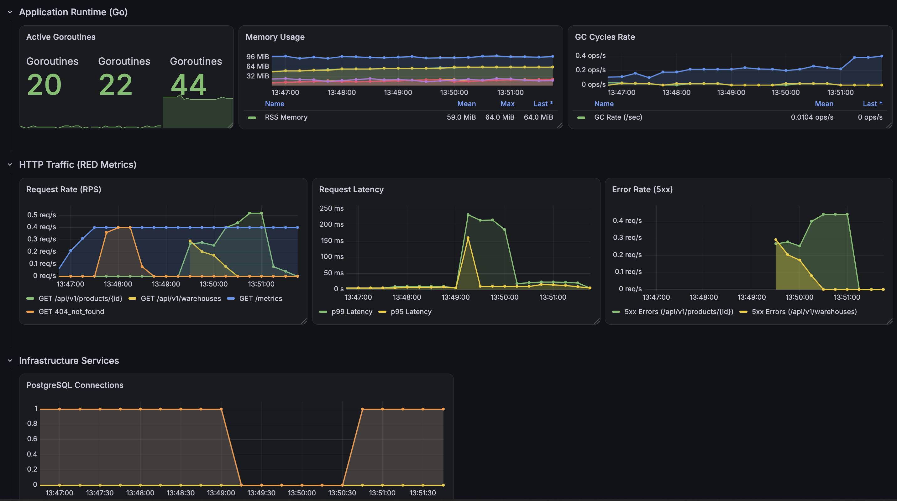

# Go-Freight: Inventory Service

Микросервис управления складскими запасами на Go.

## Стек

- **Язык**: Go 1.26
- **БД**: PostgreSQL 15, Redis 7.2
- **Роутинг**: chi
- **Работа с БД**: sqlc (генерация кода), goose (миграции)
- **Конфигурация**: cleanenv (YAML + ENV)
- **Логирование**: slog (структурированные логи, TraceID)
- **Документация API**: Swagger / OpenAPI
- **Тестирование**: testify, mockery
- **Инфраструктура**: Docker, Docker Compose, Taskfile
- **Observability**: Prometheus, Grafana, Loki, Promtail, Tempo, OpenTelemetry (OTLP)

## Архитектура

- **Clean Architecture**: слои `transport` (HTTP), `service` (бизнес-логика), `repository` (БД).
- **DI**: изолированный контейнер с ленивой инициализацией.
- **Graceful Shutdown**: кастомный `Closer` с LIFO-очередью и таймаутами на закрытие ресурсов.

## Observability

Преднастроенный стек с автоматическим провижинингом дашбордов.



- **Metrics**: RED-метрики (Rate, Errors, Duration) через chi-middleware; экспорт метрик пула соединений PostgreSQL через `otelsql`.
- **Traces**: автоматические Span'ы для HTTP-запросов (`otelchi`), отправка в Tempo по gRPC (OTLP).
- **Logs**: интеграция Docker Syslog Driver → Promtail → Loki (работает в контейнере и локально).
- **Связь**: каждый лог содержит `trace_id` для перехода к трейсу.

## Запуск

### Полный запуск в Docker

```bash
task up
```

### Локальная разработка (гибридный режим)

БД, кэш и мониторинг поднимаются в Docker, приложение – на хосте:

```bash
task infra-all   # поднять инфраструктуру
task migrate-up  # накатить миграции
task run         # запустить приложение локально
```

## REST API

Документация Swagger UI: `/swagger/index.html`.

### Склады (Warehouses)

| Метод  | Эндпоинт                           | Описание           |
| ------ | ---------------------------------- | ------------------ |
| POST   | `/api/v1/warehouses`               | Регистрация склада |
| GET    | `/api/v1/warehouses`               | Список складов     |
| GET    | `/api/v1/warehouses/{id}`          | Детали склада      |
| PUT    | `/api/v1/warehouses/{id}`          | Обновление склада  |
| DELETE | `/api/v1/warehouses/{id}`          | Удаление склада    |
| GET    | `/api/v1/warehouses/{id}/products` | Товары на складе   |

### Товары и остатки (Products)

| Метод  | Эндпоинт                                   | Описание                                    |
| ------ | ------------------------------------------ | ------------------------------------------- |
| POST   | `/api/v1/products`                         | Создание товара                             |
| GET    | `/api/v1/products/{id}`                    | Информация о товаре и остатках              |
| DELETE | `/api/v1/products/{id}`                    | Удаление товара                             |
| PATCH  | `/api/v1/products/{id}/adjust`             | Корректировка остатка (+приход / -списание) |
| PATCH  | `/api/v1/products/{id}/reserve`            | Резервирование под заказ                    |
| PATCH  | `/api/v1/products/{id}/release`            | Окончательное списание после отгрузки       |
| PATCH  | `/api/v1/products/{id}/cancel-reservation` | Отмена брони (возврат в доступный остаток)  |
